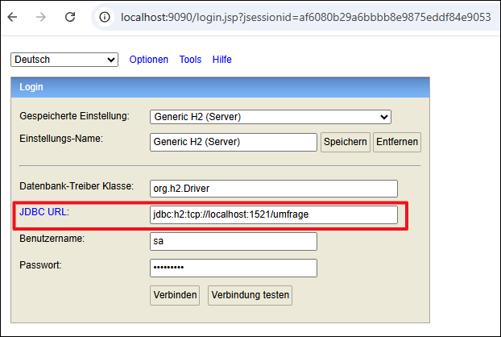
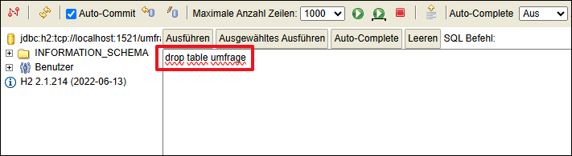

# H2-Datenbankinstanz in Docker-Container #

<br>

Die Datei [docker-compose.yml](docker-compose.yml) in diesem Verzeichnis erzeugt einen Container mit der Datenbank H2. 
Es wird folgendes Image verwendet:
* https://github.com/oscarfonts/docker-h2
* https://hub.docker.com/r/oscarfonts/h2/tags

<br>

* Container erzeugen und starten        : `docker-compose up`
* Container stoppen (aber nicht löschen): `docker-compose stop`
* Container starten                     : `docker-compose start`
* Container stoppen und löschen         : `docker-compose down`

<br>

----

## Verbindung zu H2 via HTTP und TCP ##

<br>

Die integrierte H2-Konsole ist lokal über folgende URL erreichbar: http://localhost:9090/

Für eine Verbindung ist im Feld "JDBC URL" die folgende URL einzutragen: 
```
jdbc:h2:tcp://localhost:1521/umfrage
```



Das Passwort lautet `d4tenb4nk`.

<br>

Container-intern ist die Datenbank unter Port `1521` erreichbar.
Der externe Port ist aber `9092`, so dass in der Datei `application.properties`
folgender Eintrag enthalten ist:
```
spring.datasource.url=jdbc:h2:tcp://localhost:9092/umfrage
```

<br>

----

## Datenbank zurücksetzen ##

<br>

Die Datenbankdatei befindet sich im Container, kann also nicht direkt gelöscht werden.
Zum Zurücksetzen der Datenbank kann die Tabelle `UMFRAGE` mit folgendem SQL-Befehl
in der H2-Konsole gelöscht werden:
```
drop table umfrage
```

<br>



<br>

Im Container liegt die Datei übrigens unter folgendem Pfad:
```
/opt/h2-data/umfrage.mv.db
```