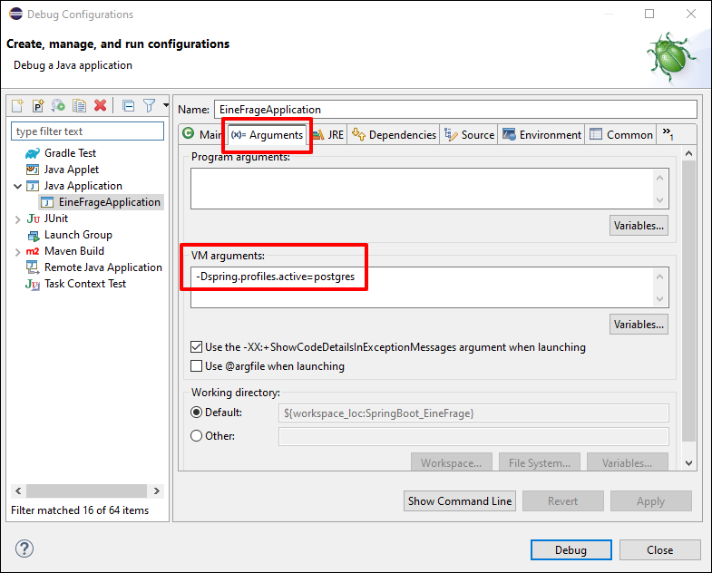
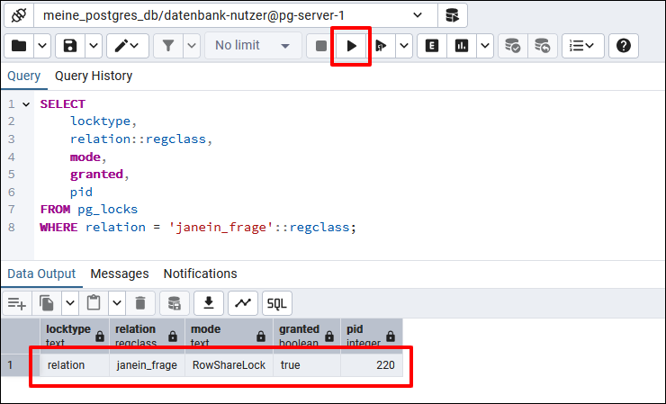

# Postgres und pgAdmin in Docker-Container #

<br>

In der H2-Konsole ist es anscheinend nicht möglich, sich aktuelle Sperren
für Datenbankzeilen anzeigen zu lassen, deshalb ist die Spring-Boot-Anwendung 
im Repo auch dafür ausgelegt, gegen eine Postgres-Datenbank zu laufen.
Für Postgres samt Web-UI *pgAdmin* findet sich in diesem Ordner eine Datei
[docker-compose.yml](docker-compose.yml).

<br>

In *pgAdmin* muss manuell die Verbindung zur Postgres-Datenbank konfiguriert werden, 
[siehe hier](https://github.com/MDecker-MobileComputing/Maven_SpringBoot_Bildergallerie/tree/master/DockerCompose-Postgres-Bildergallerie#anwendung-gegen-postgres-datenbank-in-docker-container-laufen-lassen).

<br>

----

## Anwendung mit Postgres statt H2 als Datenbank ausführen ##

<br>

* Anwendung mit Startskripten `maven_start1_postgres.bat` (Port `8080`) und `maven_start2_postgres.bat` (Port `8081`) ausführen.

* In Eclipse über Run/Debug-Konfiguration: `-Dspring.profiles.active=postgres` unter "Arguments | VM arguments" eintragen, siehe auch Screenshot unten.

<br>



<br>

----

## Sperren in pgAdmin anzeigen ##

<br>

Mit der folgenden SQL-Query in *pgAdmin* können wir uns die aktuell gesetzten
Zeilensperren für die Tabelle `janein_frage` anzeigen lassen:
```
SELECT 
    locktype, 
    relation::regclass, 
    mode, 
    granted,
    pid
FROM pg_locks 
WHERE relation = 'janein_frage'::regclass;
```

<br>



<br>