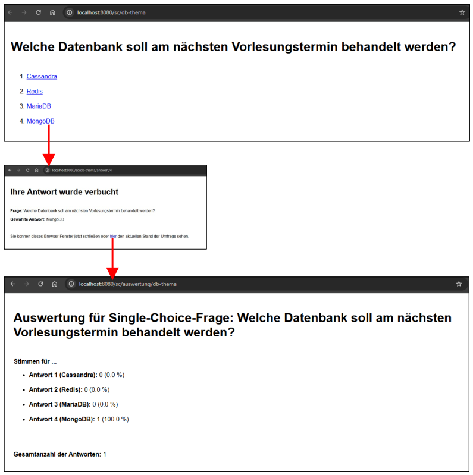

# Mini-Umfrage #

 

Das Repo enthält eine mit Java programmierte Spring-Boot-Anwendung, die *Optimistic Locking* 
mit *Spring Data JPA* demonstriert. 
Die Anwendung stellt eine Mini-Umfrage bestehend aus nur einer Single-Choice-Frage dar.
Damit mehrere Instanzen der Anwendung dieselbe Datenbank/H2-Instanz verwenden können, 
wird eine DB im [Docker-Container](Maven_SpringBoot_EineFrage) verwendet.

 

 

----

## License ##

 

See the [LICENSE file](LICENSE.md) for license rights and limitations (BSD 3-Clause License).

 
